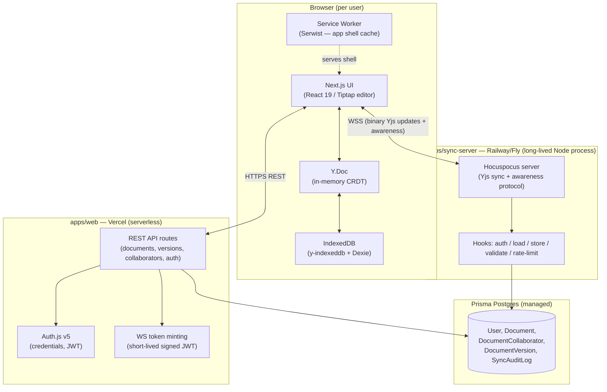

# SyncPad — Project Documentation

A local-first, collaborative document editor with offline synchronization, deterministic conflict resolution, and granular version control.

Built for the House of Edtech Fullstack Developer assignment (April 2026). This document describes **what the application is and why it's built the way it is**. For the step-by-step build sequence, see `IMPLEMENTATION_PLAN.md`.

---

## 1. Elevator Pitch

SyncPad is a Google-Docs-style rich text editor that keeps working — fully, not in some degraded read-only mode — when you have no internet connection. Every keystroke is written locally first. When the network comes back, your changes and everyone else's merge automatically, deterministically, and without a server-side "who wins" decision, because the merge algorithm is mathematically guaranteed to converge regardless of the order operations arrive in. On top of that, every document has a browsable version history, and restoring an old version never destroys what a collaborator is typing at that same moment.

---

## 2. Problem Framing — Why This Isn't a CRUD App

The brief explicitly asks for distributed-systems engineering, not a CRUD app. Three problems make this hard, and this section names them before the architecture section explains how each is solved:

1. **State synchronization race conditions.** A client can have unsynced local edits _and_ receive remote edits from other collaborators at the same moment it reconnects. Naive "last write wins" silently destroys data. Naive locking kills the "local-first, zero network requests blocking the UI" requirement.
2. **Deterministic, data-loss-free conflict resolution.** Two people editing the same paragraph offline, for hours, need to end up with the _same_ merged document on every device — not "mostly the same," and not requiring a human to pick a winner.
3. **Version control that doesn't fight #1 and #2.** Restoring an old snapshot is itself a kind of conflicting edit. A restore that just overwrites the live document will silently discard whatever a currently-connected collaborator typed a second ago.

The rest of this document is essentially the answer to those three problems, plus the product/UI/security work built around that core.

---

## 3. Core Concepts

**Local-first** — the client's local storage (IndexedDB) is the primary source of truth for the _current editing session_. The UI reads and writes there first; the network is a background concern, not a blocking dependency. Contrast with "offline-tolerant" apps that just queue REST calls and replay them — those still make the server the source of truth and hit real conflict problems the moment two queues replay out of order.

**CRDT (Conflict-free Replicated Data Type)** — a data structure engineered so that merging two replicas is _commutative_ (order doesn't matter), _associative_ (grouping doesn't matter), and _idempotent_ (applying the same change twice is safe). SyncPad's document content is a CRDT (via **Yjs**), which is what makes "deterministic conflict resolution" a property of the data structure itself rather than a piece of business logic someone has to get right. This is the same class of technology behind Figma's multiplayer engine, Linear, and Notion's block sync.

**State vector / update / snapshot** — a Yjs document can be encoded as a compact _update_ (the changes needed to bring another replica up to date) or a full _state_ (the whole document). A _state vector_ is a tiny summary of "what I've already seen," used so two peers can exchange only the delta they're missing instead of the whole document on every reconnect.

**Awareness** — the separate, ephemeral (non-persisted) channel Yjs provides for presence data: who's connected, their cursor position, their name/color. It rides over the same connection as document updates but is never written to the document's permanent history.

**Deterministic conflict resolution, concretely** — because Yjs's merge function is commutative/associative/idempotent, two clients that have seen the same set of updates — in _any_ order — always compute the identical final document. That's the literal meaning of "deterministic" here, and it's testable: see the two-browser-context convergence test in the implementation plan's Phase 11.

---

## 4. Feature List

### Local-first & offline

- Full document CRUD with zero network requests blocking the UI.
- Editor works completely offline, including first load if the app shell was previously cached (PWA).
- Local persistence survives tab close/reopen and browser restart.

### Real-time collaboration

- Multiple users editing the same document concurrently, changes appear live.
- Presence: collaborator avatars/names and live cursor positions.
- Connection status indicator: offline / connecting / syncing / synced / error.
- "N changes pending sync" counter while offline.

### Sync engine

- Automatic reconciliation on reconnect — no manual "resolve conflict" UI, because there's nothing to manually resolve.
- Delta-only resync (state-vector exchange), not a full document re-transfer, on every reconnect.
- Idempotent, order-independent update application.

### Version history / time travel

- Manual "Save version" with a label.
- Automatic periodic snapshots.
- Read-only preview of any past version.
- Restore to a past version **without discarding concurrent collaborators' live edits** (see §8).
- Tiered retention (recent auto-saves kept densely, older ones thinned out; manual saves always kept).

### Roles & permissions

- Owner / Editor / Viewer per document.
- Viewers are enforced read-only at three independent layers: UI, REST API, and the real-time server itself.
- Owner-only collaborator management (invite/remove/change role).

### Security

- Credentials-based authentication (email + password), hashed, JWT sessions.
- Defense-in-depth authorization: route-level, API-level, WS-level, and database-level (Postgres RLS).
- Strict payload validation and size ceilings to prevent malformed/oversized-payload denial-of-service.
- Rate limiting on both the REST API and the real-time server.
- Full audit log of sync events (connects, disconnects, rejected updates, restores).

### AI (optional add-on, feature-flagged)

- In-editor AI writing assistant (grammar fix / shorten / continue), streamed.
- Plain-language changelog between two versions, to help decide whether to restore.

### PWA

- Installable on desktop and mobile.
- Offline app shell (not just cached data).

### Accessibility & UI

- shadcn/ui + Radix primitives (keyboard navigable, screen-reader-friendly by default).
- Responsive layout, dark/light theme.

---

## 5. Architecture Overview



**Why two backend processes instead of one Next.js app doing everything:** Vercel's serverless functions (and most serverless hosts) cannot hold a persistent WebSocket connection open for the lifetime of a collaborative editing session. The real-time layer needs a long-lived process. Rather than fight the platform, `apps/sync-server` is a small, independently deployable Node service whose only job is the WebSocket/CRDT relay + persistence — everything else (auth, document metadata CRUD, version listing, AI) stays in ordinary serverless Next.js API routes, which is exactly where those belong.

---

## 6. Data Model (summary)

| Model                  | Purpose                                                                                                                              |
| ---------------------- | ------------------------------------------------------------------------------------------------------------------------------------ |
| `User`                 | Account + hashed password. Credentials-only, no OAuth tables needed.                                                                 |
| `Document`             | Metadata (title, owner) + the latest compacted CRDT state (`docState` bytes), kept out of list queries.                              |
| `DocumentCollaborator` | Join table: user × document × role (`OWNER`/`EDITOR`/`VIEWER`).                                                                      |
| `DocumentVersion`      | An immutable snapshot: encoded CRDT state + state vector at a point in time, labeled, manual-or-auto, who made it.                   |
| `SyncAuditLog`         | Append-only event log: connects/disconnects, accepted/rejected updates, restores — the evidence trail for the security requirements. |

Full field-level schema lives in `IMPLEMENTATION_PLAN.md`, Appendix A.

---

## 7. Roles & Permissions Matrix

| Action                   | Owner | Editor | Viewer |
| ------------------------ | :---: | :----: | :----: |
| View content             |  ✅   |   ✅   |   ✅   |
| Edit content             |  ✅   |   ✅   |   ❌   |
| Rename document          |  ✅   |   ✅   |   ❌   |
| Save / restore a version |  ✅   |   ✅   |   ❌   |
| Manage collaborators     |  ✅   |   ❌   |   ❌   |
| Delete document          |  ✅   |   ❌   |   ❌   |

Enforced independently at four layers: UI (controls hidden/disabled), REST API (every mutation route re-checks), real-time server (Viewer connections cannot originate accepted document updates), and the database (Postgres RLS as a last line of defense — see §9).

---

## 8. Sync Lifecycle Walkthrough

A concrete trace through the system, because this is the part most worth understanding deeply:

1. **Open a document.** The UI reads the local `Y.Doc` from IndexedDB immediately — this is synchronous-feeling and requires no network round trip. The editor is interactive before anything talks to a server.
2. **Type while offline.** Every keystroke becomes a Yjs operation, applied to the local `Y.Doc`, persisted to IndexedDB by `y-indexeddb` in the background. A local counter tracks "changes pending sync" for the UI indicator.
3. **Reconnect.** The client's Hocuspocus provider re-authenticates (fetches a fresh short-lived token from `apps/web`, since the previous one likely expired), then performs the Yjs sync protocol handshake: both sides exchange **state vectors** (a compact summary of what updates each side has already seen), and only the missing delta is transmitted in each direction — not the whole document.
4. **Merge.** Because Yjs's merge is commutative/associative/idempotent, applying the received delta to the local doc (and the local delta to the server's doc) produces an identical result on both ends, regardless of how many other clients' updates were interleaved in between, and regardless of the order any of it arrives in. There is no "conflict resolution step" that can fail or need a decision — convergence is a property of the data structure.
5. **Server-side persistence.** `sync-server`'s store hook periodically (debounced) writes the compacted state back to Postgres, after checking it's under the size ceiling and logging the event.
6. **Version snapshot (manual or automatic).** A copy of the current encoded state is written to `DocumentVersion`, independent of the live editing state — this is what makes history browsing possible without holding every micro-edit in memory forever.
7. **Restore.** See below — this is the one operation in the whole lifecycle that is _not_ a plain CRDT merge, and needs its own explanation.

### Why "restore" needs special handling

A CRDT merge is a union of two states — it can bring old, deleted content _back_, but it fundamentally cannot express "go back to how this looked an hour ago" as a simple merge, because a merge only ever adds information, it never selectively discards the other side's newer edits.

So SyncPad implements restore as **diff-and-reapply**, not overwrite:

1. Reconstruct the target version's content in a throwaway, disconnected `Y.Doc`.
2. Diff that reconstructed content against the _current live_ document's content.
3. Express the difference as ordinary editor operations (inserts/deletes), and apply those to the **live, shared** document through the same pipeline a normal edit takes.
4. Because the result is expressed as real CRDT operations on the live doc, it merges causally with whatever any other connected collaborator is doing at that same moment — nobody's concurrent edit gets silently discarded. The restore is just "a big edit," from the CRDT's point of view, not a state replacement.
5. The restore itself is saved as a new version, so a bad restore is itself restorable.

This is the same trick real production collaborative editors use, and it's the direct, correct answer to the brief's requirement to restore "safely, without corrupting the current shared document state for other active collaborators."

---

## 9. Security Model

**Authentication.** Email/password via Auth.js v5's Credentials provider. Passwords hashed with `bcryptjs` (pure JS — the native `bcrypt` module doesn't reliably bundle for serverless/edge runtimes). JWT sessions (not database sessions), because `apps/web` runs on serverless functions where a sticky server-side session store doesn't fit the deployment model.

**A note on middleware/proxy-only protection.** Next.js 16 renames `middleware.ts` to `proxy.ts`. It's tempting to treat that file as _the_ auth boundary, but a disclosed vulnerability (CVE-2025-29927) showed middleware-only session checks can be bypassed by spoofing an internal header. SyncPad treats `proxy.ts` as a UX convenience (fast redirect for obviously-unauthenticated page loads) and re-checks the session **independently, server-side**, in every API route and server component that touches document data. This is verified directly: the test suite includes hitting protected routes with `proxy.ts` deliberately disabled and confirming they still 401/403.

**Authorization — four independent layers:**

1. UI: controls hidden/disabled per role (convenience, not security).
2. REST API: every mutating route calls a shared `assertRole()` helper before touching the database.
3. Real-time server: a `VIEWER`-role connection's incoming update messages are rejected by the Hocuspocus server itself, not just hidden client-side — verified with a raw WebSocket script that forges an update as a Viewer.
4. Database: Postgres Row Level Security policies as a last line of defense, so a bug in the application's `WHERE` clause still cannot leak another tenant's document.

**Preventing malformed/oversized payloads from taking down the server.** This gets specific engineering attention rather than being hand-waved:

- The WebSocket server sets a hard `maxPayload` at the transport layer — an oversized frame is rejected by the socket library _before_ any Yjs decoding is attempted, so the "attack" of sending a huge blob never reaches the code that would allocate memory for it.
- A pre-authentication message buffer is bounded per connection (Hocuspocus's built-in protection), so an unauthenticated client can't hold the server's memory hostage before even passing `onAuthenticate`.
- Every accepted update is checked against a configured byte-size ceiling before being persisted; over-budget updates are rejected and logged (`SyncAuditLog`, `eventType: "update_rejected"`) rather than silently dropped or allowed to crash the store cycle.
- Per-connection rate limiting (`@hocuspocus/extension-throttle`) bounds how fast any single client can push updates, independent of size.
- On the REST side, Zod schemas enforce field-length/array-size ceilings before any handler logic runs, and Upstash-backed rate limiting caps request rate per user/IP on mutation and auth routes.
- This is tested directly: a standalone load script intentionally sends malformed/oversized frames against a running `sync-server` and the memory footprint is verified not to spike (see Implementation Plan, Phase 6 & 11).

**Tenant isolation.** Every document-scoped query is written so a user can only ever retrieve rows they have an explicit `Document.ownerId` or `DocumentCollaborator` relationship to — enforced at the application layer and, redundantly, via Postgres RLS.

---

## 10. Performance & Memory Management

The brief specifically calls out browser-based memory management and "preventing client-side lag during rapid typing." Concretely:

- **Yjs garbage collection stays enabled** on the live, in-session document (`gc: true`, the default). Full editing history isn't kept in browser memory indefinitely — durable version history lives in Postgres as periodic compacted snapshots instead, which is a deliberate trade-off: unbounded in-memory tombstone retention (`gc: false`) would let long editing sessions grow memory without bound, in exchange for finer-grained undo than we actually need once Postgres-backed versioning exists.
- **IndexedDB compaction.** `y-indexeddb` accumulates incremental update log entries; these are periodically compacted into a single consolidated update so local storage doesn't grow unbounded over a long-lived document.
- **Awareness/presence throttling.** Cursor position broadcasts are throttled (roughly 80–120ms), not sent on every keystroke/mousemove — this is a meaningful chunk of the "lag during rapid typing" risk if left unthrottled, since it multiplies re-renders across every connected client.
- **Cleanup on unmount/tab-hide.** WebSocket connections, Yjs observers, and awareness state are explicitly torn down when an editor view unmounts; a `visibilitychange` listener pauses non-critical background work (e.g., presence heartbeats) when the tab isn't visible; `beforeunload` flushes pending IndexedDB writes.
- **Document size growth over time.** Addressed by the version-retention/compaction policy (§8, and Implementation Plan Phase 8) — this is the app-level answer to "how do you keep a long-lived, frequently-edited document from growing without bound," distinct from the in-memory GC question above.

---

## 11. PWA / Offline Strategy

SyncPad is installable and its **app shell** — not just API responses — loads with no network connection at all, via a Serwist-generated service worker (chosen over the older `next-pwa` specifically because `next-pwa` depends on Webpack, and Next.js 16 defaults to Turbopack). This matters for the local-first story beyond just "the editor still works offline": a user should be able to launch the installed app itself from a dead connection and land on their cached document list, not a browser error page.

---

## 12. AI Features

Marked "good to have" in the brief and treated accordingly: real, but strictly additive. Built on the Vercel AI SDK with a provider abstraction (`AI_PROVIDER` env var selects Groq / OpenAI / Gemini), so the core application — auth, editing, sync, versioning, security — is fully functional and fully tested with **zero** AI API keys configured. Two features:

1. **In-editor AI assistant** — selection-aware grammar/shortening/continuation, streamed token-by-token into the editor.
2. **Version-diff summarizer** — a plain-language changelog between two versions, surfaced next to the Restore action so a user isn't stuck reading a raw diff to decide.

---

## 13. Tech Stack Rationale

| Requirement                       | Choice                                                                                           | Why this over the alternatives                                                                                                                                                                                                                                                                                                                                                                                                                                                                                                                                                     |
| --------------------------------- | ------------------------------------------------------------------------------------------------ | ---------------------------------------------------------------------------------------------------------------------------------------------------------------------------------------------------------------------------------------------------------------------------------------------------------------------------------------------------------------------------------------------------------------------------------------------------------------------------------------------------------------------------------------------------------------------------------- |
| Deterministic conflict resolution | Yjs (CRDT)                                                                                       | Convergence is a mathematical property of the data structure (commutative/associative/idempotent merge), not application logic that can have a bug. Hand-rolling a merge algorithm (OT, custom diff/patch) in an assignment timeframe would mean shipping a _less_ battle-tested version of what Figma/Linear/Notion already use — the actual engineering value-add is everywhere _around_ the CRDT (offline queue, version control, security, race-condition handling), not in re-deriving CRDT math.                                                                             |
| Real-time transport               | Self-hosted Hocuspocus, not raw `ws` + hand-written sync protocol, and not the paid Tiptap Cloud | Hocuspocus is purpose-built for exactly this (Yjs + Tiptap backend) and is open source/self-hostable — same reasoning as "use Next.js instead of writing your own HTTP server." Self-hosting (vs. the paid cloud offering) keeps persistence, auth, and data entirely inside our own Postgres/infrastructure.                                                                                                                                                                                                                                                                      |
| Local persistence                 | `y-indexeddb` + Dexie                                                                            | `y-indexeddb` is the standard, tested Yjs-to-IndexedDB persistence adapter; Dexie handles the _non_-CRDT local metadata (document list cache, sync bookkeeping) that y-indexeddb isn't meant for.                                                                                                                                                                                                                                                                                                                                                                                  |
| Editor                            | Tiptap (ProseMirror)                                                                             | First-class, well-maintained Yjs collaboration integration (`@tiptap/extension-collaboration`, `-collaboration-caret`), headless enough to fully restyle with shadcn/Tailwind.                                                                                                                                                                                                                                                                                                                                                                                                     |
| Database                          | Prisma Postgres                                                                                  | Mandated (Postgres) + managed connection pooling out of the box, which matters here specifically because two very differently-shaped processes (serverless `apps/web`, long-lived `apps/sync-server`) hit the same database.                                                                                                                                                                                                                                                                                                                                                       |
| Auth                              | Auth.js v5, Credentials, JWT sessions                                                            | Mandated (NextAuth, credentials). JWT over DB sessions because the web app is serverless.                                                                                                                                                                                                                                                                                                                                                                                                                                                                                          |
| PWA tooling                       | Serwist over `next-pwa`                                                                          | `next-pwa` requires Webpack; Next 16 defaults to Turbopack. Serwist is the current, Turbopack-compatible successor.                                                                                                                                                                                                                                                                                                                                                                                                                                                                |
| Monorepo                          | pnpm workspaces only, no build-orchestration tool                                                | Two deployable apps + shared Prisma client + shared Zod schemas need a real workspace/dependency graph, which pnpm workspaces provides natively (`workspace:*` references, `pnpm --filter`, `pnpm -r`). A caching/pipeline layer like Turborepo earns its keep when many packages share build steps that benefit from caching or when a single command needs to orchestrate a lot of interdependent work — here the two apps deploy to entirely separate targets and are run independently in development, so that layer would be config overhead without a real problem to solve. |
| Version storage                   | Full encoded Yjs state per snapshot in Postgres (not just in-memory Yjs snapshots)               | In-memory-only version tracking (`Y.Snapshot` with GC disabled) would tie history retention to keeping the live document's memory usage unbounded for the life of the session — durable, external snapshots decouple "how much history we keep" from "how much memory the live editor uses."                                                                                                                                                                                                                                                                                       |

---

## 14. Evaluation Criteria Cross-Reference

Mapping the brief's own "Evaluation Criteria" section to where each item is addressed, so completeness is easy to verify at a glance.

| Brief's criterion                                                     | Where it's addressed                                               |
| --------------------------------------------------------------------- | ------------------------------------------------------------------ |
| Offline-sync process completeness/correctness                         | §8 Sync Lifecycle; Implementation Plan Phases 4, 6, 7              |
| Deterministic conflict resolution, no data loss                       | §3 Core Concepts, §8; the two-context convergence test in Phase 11 |
| Functional version history                                            | §8 restore walkthrough; Implementation Plan Phase 8                |
| Data validation                                                       | §9 Security Model; Phase 6 & 9                                     |
| Authentication & authorization                                        | §9; Phase 2, 9                                                     |
| UI friendliness, responsiveness, connection indicators, accessibility | §4 Feature List; Phase 5, 7, 12                                    |
| Code quality / complex state sync logic / docs / optimization         | Repo structure in Implementation Plan §2; §10 Performance section  |
| Testing coverage, especially the sync engine                          | Implementation Plan Phase 11                                       |
| Deployment & CI/CD                                                    | Implementation Plan Phase 12                                       |
| Real-world considerations (e.g., doc size growth over time)           | §10 (retention/compaction), §9 (payload ceilings)                  |

---

## 15. Known Limitations & Future Work

- **WebSocket server is a single instance by default.** Horizontal scaling across multiple `sync-server` instances needs a shared pub/sub backplane between them (Hocuspocus supports a Redis-backed extension for this) — out of scope for the assignment but noted as the clear next step for real production scale.
- **Multi-tab-per-user leader election** (avoiding redundant IndexedDB writers/WS connections when the same user has a document open in two tabs) is designed for but marked optional/stretch in the implementation plan (Web Locks API-based leader election) rather than mandatory — the app is correct without it, just marginally less efficient with many tabs open.
- **AI features are provider-dependent** and intentionally excluded from the core correctness/security guarantees — they're additive, not load-bearing.
- **Structural (not just textual) diffing for restore** — the diff-and-reapply restore mechanism operates over the editor's structured content (headings, lists, marks), which is more involved than a plain text diff; this is called out explicitly in the implementation plan as the part of the build that deserves the most care and the most test coverage.

---

## 16. Local Development Quickstart

```bash
pnpm install
cp .env.example .env            # fill in DATABASE_URL, DIRECT_URL, AUTH_SECRET, etc.
pnpm db:migrate
```

Then run each app in its own terminal — there's no single orchestrated `dev` command, by design (see Implementation Plan, Phase 0):

```bash
# terminal 1
pnpm --filter web dev           # http://localhost:3000

# terminal 2
pnpm --filter sync-server dev   # ws://localhost:1234
```

Full environment variable reference and phase-by-phase build instructions: `IMPLEMENTATION_PLAN.md`.

---

## 17. Glossary

| Term                  | Meaning                                                                                                                                                                          |
| --------------------- | -------------------------------------------------------------------------------------------------------------------------------------------------------------------------------- |
| CRDT                  | Conflict-free Replicated Data Type — a data structure whose merge operation is commutative, associative, and idempotent, guaranteeing all replicas converge to the same state.   |
| Yjs                   | The CRDT library used for document content in SyncPad.                                                                                                                           |
| Hocuspocus            | Open-source WebSocket backend built on Yjs, used to relay and persist real-time updates.                                                                                         |
| Awareness             | Yjs's ephemeral, non-persisted presence channel (cursors, online users).                                                                                                         |
| State vector          | A compact summary of which updates a replica has already seen, used to compute minimal deltas.                                                                                   |
| Local-first           | An architecture where local storage is the primary source of truth for the active session, and network sync is a background concern.                                             |
| RLS                   | Row Level Security — Postgres feature restricting which rows a query can see/touch based on session context, enforced at the database engine level.                              |
| Restore (in this app) | Reconstructing a past version and reapplying the difference as new CRDT operations on the live document, rather than overwriting it — preserves concurrent collaborators' edits. |
